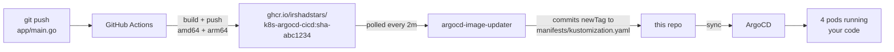

# k8s-argocd-cicd

A working **code → container → pod** pipeline. Push a change to `app/main.go` and it
reaches a running pod with no `kubectl apply` and no hand-edited image tag.



The loop closes: CI writes the tag back to Git, and Git is what ArgoCD deploys. Nothing
in the cluster is the source of truth.

## Layout

| Path | What it is |
|---|---|
| `app/` | Go HTTP server, stdlib only. Reports its own version, commit, and pod name. |
| `Dockerfile` | Multi-stage → `distroless/static:nonroot`. 14 MB, no shell, no libc. |
| `.github/workflows/build.yaml` | Builds and pushes to GHCR on pushes that touch `app/` or `Dockerfile`. |
| `manifests/` | Kustomize app: Deployment (4 replicas), Service, PDB, Namespace. |
| `argocd/application.yaml` | The ArgoCD Application. Applied once by hand. |
| `argocd/imageupdater.yaml` | ImageUpdater CR — the automatic tag bumping. Applied once by hand. |
| `kind/cicd-cluster.yaml` | The local cluster: 1 control-plane + 2 workers, host port 31080. |
| `docs/cicd.md` | How it works, what broke, and why each decision was made. |

## Try it

```bash
kind create cluster --config kind/cicd-cluster.yaml

kubectl create namespace argocd
kubectl apply -n argocd --server-side=true \
  -f https://raw.githubusercontent.com/argoproj/argo-cd/stable/manifests/install.yaml

kubectl apply -f argocd/application.yaml
curl http://localhost:31080/
```

`--server-side=true` is not optional — see `docs/cicd.md`.

For the automatic half you also need the Image Updater controller and a GitHub PAT.
Both steps are in [`docs/cicd.md`](docs/cicd.md).

## What it demonstrates

- Immutable, content-addressed image tags (`sha-<short>`) — "what is running?" always has an answer
- Multi-arch builds via native cross-compilation, not QEMU
- A **structural** CI loop guard (`paths:` filters) rather than `[skip ci]`
- Git write-back, so the cluster and the repo never disagree
- A hardened pod: non-root UID 65532, read-only root filesystem, all capabilities dropped
- Graceful shutdown that actually drains: fail readiness → wait for endpoint propagation → exit
