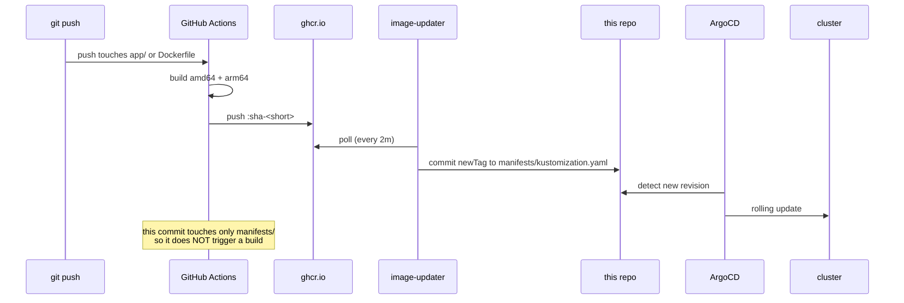

# The CI/CD pipeline

How a `git push` becomes a running pod, and the things that had to be worked around to
make it true.

## The loop



## Who owns the image tag

Exactly one place: the `images:` block in `manifests/kustomization.yaml`.

The `image:` line in `deployment.yaml` is a starting value that Kustomize overrides at
render time. Image Updater rewrites the kustomization, never the deployment. If you want
to know what is deployed, read `kustomization.yaml` — and `kubectl kustomize manifests/`
renders locally exactly what ArgoCD applies.

## Four things that had to be worked around

### 1. Image Updater cannot read plain YAML

From the upstream docs: *"Argo CD Image Updater can only update container images for
applications whose manifests are rendered using Kustomize, Helm, or a Config Management
Plugin."* Plain directories are explicitly unsupported.

So `manifests/` had to become a Kustomize application. That is the only reason
`kustomization.yaml` exists. ArgoCD auto-detects the directory as Kustomize from the
file's presence, so the Application spec needs no source type.

### 2. v1.3.0 ignores the annotations every tutorial shows you

This is the big one, and it cost the most time.

Essentially every guide online configures Image Updater with
`argocd-image-updater.argoproj.io/*` annotations on the Application. That was correct
through v0.x. **v1.3.0 is a controller-runtime rewrite that watches `ImageUpdater` custom
resources and nothing else.** Its own startup log says so:

```
source="kind source: *v1alpha1.ImageUpdater"
"No ImageUpdater CRs to process"
```

The controller never lists Applications looking for annotations. Annotation-based config
on this version fails **silently** — no error, no warning, it simply does nothing.

The live config is `argocd/imageupdater.yaml`. The old annotations are still in
`argocd/application.yaml`, commented with a pointer, because leaving them visible and
labelled is more useful than deleting them and later wondering why the tutorials disagree.

Verify the CR is actually being processed:

```bash
kubectl -n argocd logs deploy/argocd-image-updater-controller --tail=40 \
  | grep -E "Processing results|image update cycle"
```

A healthy cycle looks like:

```
Starting image update cycle, considering 1 application(s) for update
Processing results: applications=1 images_considered=1 images_skipped=0 images_updated=0 errors=0
```

`images_updated=0` with `errors=0` is **correct** when the deployed tag is already the
newest — it means the updater looked and found nothing to do.

### 3. The build ↔ commit loop is real

Actions triggers on push to `main`. Image Updater commits to `main`. Unguarded, that is
infinite: build → push image → commit tag → build → forever.

The guard is a `paths:` filter in the workflow, covering only `app/**`, `Dockerfile`,
`.dockerignore`, and the workflow file. Image Updater only ever touches
`manifests/kustomization.yaml`, so its commits cannot trigger a build.

A `[skip ci]` marker in the commit message would also work, but the filter is
**structural** — it cannot be defeated by someone editing a commit template.

This was verified empirically: a manifests-only push produced no new workflow run.

### 4. amd64 CI, arm64 laptop

GitHub's hosted runners are amd64. A kind cluster on an Apple Silicon Mac is arm64. An
amd64-only image pushes fine, pulls fine in CI, and then fails on the laptop with:

```
Failed to pull image: no match for platform in manifest: not found
```

All four pods sat in `ImagePullBackOff`.

The fix is a multi-arch build, done by **native cross-compilation** rather than QEMU
emulation:

```dockerfile
FROM --platform=$BUILDPLATFORM golang:1.25 AS build
ARG TARGETOS=linux
ARG TARGETARCH
RUN CGO_ENABLED=0 GOOS=${TARGETOS} GOARCH=${TARGETARCH} go build ...
```

`--platform=$BUILDPLATFORM` pins the *builder* to the runner's own architecture, and
`GOARCH` targets the other. Go cross-compiles natively — same result, roughly 5-10× faster
than emulating arm64 under QEMU. The build takes ~57s for both platforms.

The `ImageUpdater` CR also sets `platforms: [linux/arm64]`. Without it the updater may read
the creation timestamp from the wrong manifest in the multi-arch index.

## Why `sha-<short>` and not `latest`

A mutable tag makes "which code is running?" unanswerable, and gives Image Updater nothing
to work with — `newest-build` detects a **newer** tag, not changed bytes behind the same
name.

Content-addressed tags also make `imagePullPolicy: IfNotPresent` safe: a given tag always
means the same bytes, so a cached layer is never stale.

`allowTags: regexp:^sha-[0-9a-f]{7}$` restricts deployment to tags CI actually produced.
Without it, a stray `docker push :test` would reach the cluster automatically.

## Setup

### 1. Cluster

```bash
kind create cluster --config kind/cicd-cluster.yaml
```

Two workers, not one — `topologySpreadConstraints` in the Deployment are meaningless with a
single schedulable node. Host port 31080 is mapped through `extraPortMappings`; 30080 was
already claimed by another local cluster.

### 2. ArgoCD

```bash
kubectl create namespace argocd
kubectl apply -n argocd --server-side=true \
  -f https://raw.githubusercontent.com/argoproj/argo-cd/stable/manifests/install.yaml
```

**`--server-side=true` is mandatory.** Client-side apply fails because the
`applicationsets.argoproj.io` CRD exceeds the 262144-byte limit on the
`last-applied-configuration` annotation.

### 3. Image Updater

```bash
kubectl apply -n argocd \
  -f https://raw.githubusercontent.com/argoproj-labs/argocd-image-updater/stable/config/install.yaml
```

> **Known issue with the upstream manifest.** As shipped, the controller's args are
> `["--metrics-bind-address=:8443", "run"]` — the flag comes *before* the subcommand.
> Cobra rejects it at root level, prints usage text, and exits. The pod crashloops
> indefinitely (152 restarts here) while the logs show nothing but help output, which makes
> it look like a config problem rather than a parse failure.
>
> Metrics are not needed here, so drop the flag:
>
> ```bash
> kubectl -n argocd patch deploy argocd-image-updater-controller --type=json \
>   -p='[{"op":"replace","path":"/spec/template/spec/containers/0/args","value":["run"]}]'
> ```
>
> **This patch is not stored in Git** — reinstalling from upstream reintroduces the
> crashloop. Re-apply it after any reinstall.

### 4. The git credential (manual, by design)

Image Updater needs push access to commit the tag back. This is a secret: it is never
committed, and it must be your own PAT.

Create a classic token with **`repo`** scope at https://github.com/settings/tokens, then:

```bash
kubectl -n argocd create secret generic git-creds \
  --from-literal=username=irshadstars \
  --from-literal=password=<your-PAT>
```

The CR references it as `method: git:secret:argocd/git-creds`.

Nothing else in this pipeline needs a secret: Actions authenticates to GHCR with its
built-in `GITHUB_TOKEN`, and the package is public so the kubelet pulls anonymously.

### 5. Apply the pipeline

```bash
kubectl apply -f argocd/application.yaml
kubectl apply -f argocd/imageupdater.yaml
```

Both live outside `manifests/` deliberately, so ArgoCD does not manage its own definition.

## The end-to-end test

Change the greeting in `app/main.go`, commit, push — then **touch nothing**:

```bash
git push
watch -n5 'curl -s http://localhost:31080/'
```

Expect roughly 3-4 minutes: Actions build ~1 min, Image Updater poll up to 2 min, ArgoCD
sync a few seconds. Success is the new text appearing with **no `kubectl apply` and no
manual tag edit**, plus an Image Updater commit in the log:

```bash
git pull && git log --oneline -3   # expect a commit authored by your PAT
```

## What has actually been verified

Run on 2026-10-02 by pushing a one-line greeting change (`8fafad5`) and then touching
nothing. Four of the five links are proven; the fifth is blocked on the credential below.

| Link | Evidence |
|---|---|
| push → Actions | Build completed in ~1 min, `conclusion=success` |
| Actions → GHCR | `sha-8fafad5` present as an OCI index with `linux/amd64` + `linux/arm64`, fetched with **no credentials** (which also proves the package is public) |
| Updater detects the new tag | `Setting new image to ghcr.io/irshadstars/k8s-argocd-cicd:sha-8fafad5` |
| Updater resolves the bump | `Successfully updated image 'sha-64d3a80' -> 'sha-8fafad5', but pending spec update` |
| **Updater commits to Git** | ❌ `Could not update application spec: could not get creds for repo ...: secrets "git-creds" not found` |

So the cycle ends at `errors=1`, and that single error names the one missing file. Create
the secret (next section) and the following 2-minute poll closes the loop with no push and
no rebuild — `sha-8fafad5` is already sitting in the registry waiting.

Also observed: GitHub delivered the same push event **twice**, producing two identical runs
for one commit. Harmless, because the tag is content-addressed and both runs produce the
same bytes, but it wastes runner minutes. Fixed with a `concurrency` group keyed on the ref
so a newer run cancels the one in flight.

## Verification commands

```bash
# App
curl http://localhost:31080/            # version, commit, pod
curl http://localhost:31080/healthz     # liveness
curl http://localhost:31080/readyz      # readiness
curl -o /dev/null -w '%{http_code}\n' http://localhost:31080/nonsense   # 404

# Cluster
kubectl --context kind-cicd -n cicd get pods -o wide
kubectl --context kind-cicd -n argocd get app webapp

# Renders locally exactly as ArgoCD applies it
kubectl kustomize manifests/

# Image Updater
kubectl --context kind-cicd -n argocd logs deploy/argocd-image-updater-controller --tail=40

# CI
gh run list --limit 3
```

## Failure modes, in the order worth checking

| Symptom | Cause |
|---|---|
| No new workflow run | `paths:` filter — did the push touch `app/` or `Dockerfile`? |
| `ImagePullBackOff`, `no match for platform` | Image is single-arch; check `platforms:` in the workflow |
| `images_updated=0` forever, `errors=0` | Tag already newest, **or** `allowTags` regex does not match |
| Updater logs 401/403 | GHCR package is private |
| Updater logs push rejected | `git-creds` missing, wrong, or PAT lacks `repo` scope |
| Updater logs nothing about your app | Annotations instead of an `ImageUpdater` CR — see §2 |
| Pod crashloops with help text | The args bug in §3 of Setup |

## A resource lesson worth recording

The Docker Desktop VM on this laptop has **7.75 GB**. Five kind clusters running at once
consumed **~6.8 GB of it**, and the symptom was not an out-of-memory error — it was
`net/http: TLS handshake timeout` on every `kubectl` call, with `argocd-server` quietly
restarting 85 times.

A starved control plane looks exactly like a network problem. When `kubectl` times out
against a local cluster, check `docker stats` before suspecting anything else.

```bash
docker stop $(docker ps -q --filter name=other-cluster)   # reversible; docker start brings it back
```

## Not covered

Ingress and TLS, `base/` + `overlays/` for multiple environments, Prometheus metrics on the
app, and image signing / attestation. Each is a reasonable next step; none is needed to
prove the code-to-pod loop.
